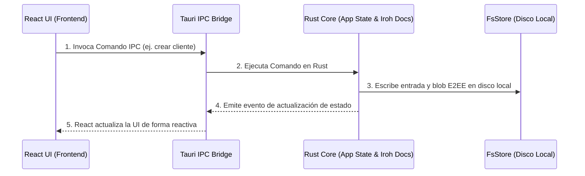

# Motor de Base de Datos

Syntrix utiliza un sistema de persistencia local híbrido diseñado para garantizar una **inmediatez radical** (operaciones en cero milisegundos en local) y una **sincronía orgánica** en segundo plano. 

No dependemos de bases de datos tradicionales en el frontend (como TanStack DB o motores de consulta tradicionales del navegador), sino que delegamos la lógica de persistencia, consulta y seguridad completamente al backend en Rust a través de Iroh.

## Componentes del Almacenamiento

El almacenamiento local y su motor de base de datos se estructuran de la siguiente manera:

1. **Memoria y Estado (Frontend - React)**:
   - React consume directamente el estado que le expone Tauri mediante llamadas IPC.
   - La UI reacciona instantáneamente a las actualizaciones emitidas en tiempo real por el backend.

2. **Iroh Docs / FsStore (Backend - Rust)**:
   - **Persistencia Física (`FsStore`)**: El backend de Rust utiliza el almacenamiento físico (`FsStore` de `iroh-blobs` y persistencia física de `iroh-docs`) guardando los archivos directamente en el disco duro del usuario (dentro del directorio de datos local de la app).
   - **Formato Llave-Valor Inmutable**: La información se modela como entradas estructuradas dentro de los namespaces de Iroh Docs. Las mutaciones son tratadas criptográficamente y los blobs de datos asociados se guardan cifrados localmente.
   - **Integración con Tauri**: Toda operación de escritura/consulta viaja a través del puente IPC de Tauri hacia el crate `syntrix-admin` o `syntrix-client` correspondientes, procesándose a nivel nativo.

---

## Flujo de Escritura de Datos

El flujo para guardar o modificar cualquier entidad en Syntrix sigue esta secuencia:

> [!NOTE]
> Gracias a este diseño, las consultas de lectura y filtrado no se realizan en el frontend, sino que se delegan a la rapidez de Rust en el backend. Toda la base de datos se almacena de forma segura y encriptada (at-rest) en la máquina del usuario final.
