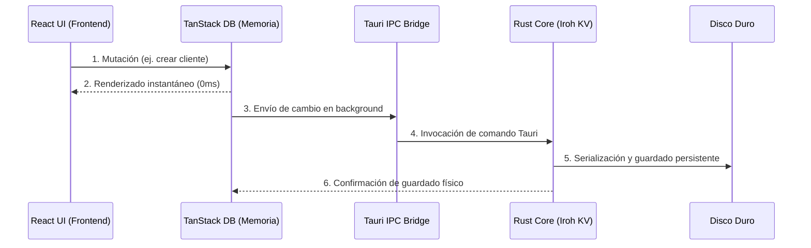

# Motor de Base de Datos

Syntrix utiliza un sistema de persistencia híbrido diseñado para garantizar una **inmediatez radical** (operaciones en cero milisegundos en local) y una **sincronía orgánica** en segundo plano.

## Componentes del Almacenamiento

El almacenamiento local se compone de dos capas principales:

1. **TanStack DB (Frontend)**: 
   - Provee el motor de consulta y mutación en memoria para la interfaz de usuario en React.
   - Permite búsquedas, filtros y renderizado instantáneo de tablas de datos.
2. **Iroh KV / SQLite (Backend Rust)**:
   - Capa de persistencia persistente e inmutable en el disco duro.
   - Maneja la criptografía de los datos guardados (at-rest) y prepara las entradas para su sincronización P2P.

---

## Flujo de Escritura de Datos

El flujo para guardar o modificar cualquier entidad en Syntrix sigue esta secuencia:

> [!NOTE]
> Gracias a este diseño, si el guardado físico en disco o la sincronización de red tarda unos milisegundos, el usuario nunca experimenta retrasos en la interfaz porque la UI responde inmediatamente utilizando la memoria de **TanStack DB**.
