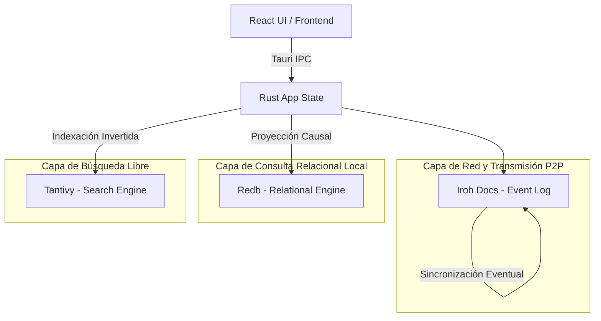

# Motor de Base de Datos

Syntrix implementa una arquitectura de datos descentralizada basada en **Event Sourcing** y **Proyecciones Locales**. En lugar de depender de una base de datos relacional centralizada (como PostgreSQL) o de motores de almacenamiento tradicionales en el frontend, Syntrix separa la capa de transmisión de red/consistencia de la capa de consulta local y texto completo.

---

## 1. Arquitectura de Tres Capas

La persistencia y el motor de datos local en el backend en Rust se dividen en tres capas con propósitos claramente separados:



### Capa 1: El Log de Eventos (Iroh Docs - Replicación P2P)
- **Persistencia de Eventos**: Toda escritura/mutación (crear un cliente, actualizar inventario, emitir factura) se guarda como un evento inmutable dentro del log de réplicas de **Iroh Docs**.
- **Hybrid Logical Clocks (HLC)**: Las claves de los eventos se ordenan mediante HLC con el formato `evt:<timestamp_hlc>:<node_id_hlc>`. Esto garantiza que los cambios tengan un orden causal estricto sin necesidad de un servidor de hora central, tolerando desvíos horaria de relojes locales de dispositivos.

### Capa 2: La Proyección Relacional (Redb - Almacenamiento Embebido)
- **Redb**: Una base de datos embebida escrita en Rust, altamente transaccional e in-process, que almacena el "estado proyectado" consolidado de los datos.
- **Tabla `DOCUMENTS`**: Mapea `doc:{org_id}:{entity}:{doc_id}` -> `Payload JSON (bytes)`. Permite lecturas de documentos consolidados a O(1).
- **Tabla `INDEXES`**: Almacena índices secundarios lexicográficos usando el formato `idx:{org_id}:{entity}:{field}:{value}:{doc_id}` -> `[]`. Esto permite resolver búsquedas y filtros ordenados a O(log N) sin realizar escaneos completos.

### Capa 3: Búsqueda de Texto Completo (Tantivy)
- **Índice Invertido Local**: Cada vez que se actualiza o inserta un documento, se indexa en **Tantivy** (un motor de búsqueda rápida de texto completo en Rust).
- Permite al frontend realizar búsquedas de lenguaje natural, términos difusos (*fuzzy search*) y obtener fragmentos de coincidencia destacados (*highlighted snippets*) en microsegundos directamente desde la máquina del usuario.

---

## 2. Comparativa Relacional: SQL vs. Arquitectura Syntrix

Dado que el modelado en Syntrix se construye sobre clave-valor criptográfico y eventos distribuidos, la traducción conceptual de un paradigma relacional tradicional cambia radicalmente:

| Concepto Relacional (SQL) | Traducción en Syntrix (P2P + Redb + Tantivy) | Mecanismo Interno y Comportamiento |
| :--- | :--- | :--- |
| **Tablas** (ej. `customers`) | Colecciones de documentos JSON proyectadas bajo el prefijo `doc:{org_id}:customers:` en **Redb**. | Flexibilidad de esquema. Cada documento es autodescriptivo. |
| **Fila / Registro** | Un documento JSON mapeado por su identificador único `doc_id`. | Los datos se guardan estructurados e indexados como blobs de bytes JSON. |
| **Clave Primaria** | El sufijo `doc_id` en la tabla `DOCUMENTS`. | Usualmente derivado del HLC o UUID de la entidad. |
| **UPDATE / INSERT** | Se escribe un nuevo evento causal en **Iroh Docs**. El indexador local intercepta el evento e incrementa/modifica la proyección física. | Operación 100% libre de bloqueos. Garantiza consistencia eventual P2P a nivel de red y local. |
| **Búsqueda por Texto (`LIKE`)** | Motor de búsqueda invertida **Tantivy**. | Búsqueda por lenguaje natural o aproximaciones directamente sobre el índice optimizado en disco. |

---

## 3. Hibridación de Datos: Event Sourcing P2P vs. Proyecciones Locales

Syntrix no utiliza una única estrategia. Combina el modelo **Event Sourcing** (para la transmisión distribuida en red P2P) con el modelo de **Proyecciones de Estado** (para las lecturas locales y consultas del frontend):

#### Capa de Red P2P (Iroh Docs)
El almacenamiento distribuido de Iroh Docs opera bajo **Event Sourcing**. Los datos son inmutables y de solo añadir (*append-only*). Las claves nunca se sobrescriben directamente para evitar conflictos de sincronización de red.

- **Formato de Clave Causal (HLC)**: `evt:<timestamp_hlc>:<count>:<node_id>`
- **Valor (Encapsulado de Evento)**:
  ```json
  {
    "type": "customer.upsert",
    "hlc": { "ts": 1719414545000, "count": 2, "node": "f8a4b27a..." },
    "payload": {
      "id": "cust_1234",
      "name": "Juan Perez",
      "email": "juan@gmail.com"
    }
  }
  ```

#### Capa de Consulta Local (Redb y Tantivy)
Para evitar que el frontend tenga que leer secuencialmente el log histórico de eventos de Iroh Docs cada vez que solicita datos (lo cual arruinaría el rendimiento), el backend nativo proyecta el estado actual a la base de datos local **Redb** como registros planos consolidados.

- **Formato de Clave Estática**: `doc:{org_id}:{entity}:{doc_id}` (ej: `doc:org_abc:customer:cust_1234`)
- **Valor (JSON plano consolidado)**:
  ```json
  {
    "id": "cust_1234",
    "name": "Juan Perez",
    "email": "juan@gmail.com"
  }
  ```

#### Ciclo de Vida de las Mutaciones

| Operación | Comportamiento en Iroh Docs (Red P2P) | Comportamiento en Redb (Base de Datos Local) |
|---|---|---|
| **Crear (Insert)** | Genera un evento `entity.upsert` con clave temporal única `evt:<hlc>`. | Inserta el payload plano en `DOCUMENTS` y crea sus entradas indexadas en `INDEXES`. |
| **Editar (Update)** | Genera **otro** evento `entity.upsert` con una clave `evt:<hlc>` más reciente. | Sobrescribe el JSON en `DOCUMENTS` con el nuevo payload y actualiza las claves del índice. |
| **Borrar (Delete)** | Genera un evento `entity.delete` (tombstone) con clave `evt:<hlc>` que registra criptográficamente la eliminación. | Elimina físicamente el documento en `DOCUMENTS` y sus índices en `INDEXES` para no ser consultado más. |

---

## 4. Manejo de Índices y Esquemas en Redb

### Estructura de las Claves de Índices en Redb
El motor relacional indexa automáticamente cada campo de primer nivel del JSON (que sea de tipo string, número o boolean) convirtiendo el valor a minúsculas para búsquedas insensibles a mayúsculas:


```rust
// Inserción de un índice secundario para buscar facturas pendientes
let idx_key = format!("idx:{}:{}:{}:{}:{}", org_id, "invoices", "status", "pending", doc_id);
idx_table.insert(idx_key.as_str(), &[] as &[u8])?;
```

Cuando el frontend solicita listar facturas pendientes, el motor realiza una consulta de rango:
1. Genera el prefijo de búsqueda: `idx:{org_id}:invoices:status:pending:`.
2. Lee las claves coincidentes en la tabla `INDEXES`.
3. Extrae el `doc_id` del final de cada clave recuperada.
4. Consulta de forma directa en la tabla `DOCUMENTS` la clave `doc:{org_id}:invoices:{doc_id}` para obtener el JSON completo.

---

## 5. Resiliencia y robustez de los Datos

Para garantizar la integridad y robustez del sistema ante fallos o corrupciones de disco, Syntrix implementa los siguientes mecanismos:

### A. Reconstrucción de Proyecciones (Rebuild from Scratch)
El archivo de base de datos relacional y de búsquedas (`syntrix_indexes.redb` y el directorio `search_index`) son **volátiles**. Es decir, son una caché optimizada para consultas construida a partir de los datos históricos. 
Si el archivo de índices se corrompe o se elimina:
1. Se limpia el directorio local de Redb y Tantivy.
2. Se escanea el historial de eventos completo de **Iroh Docs** en orden temporal/causal.
3. Se vuelve a procesar cada evento invocando `upsert_document`, recuperando el estado completo de la base de datos en cuestión de segundos.

### B. Versionamiento y Migraciones de Esquema (Upcasting)
Al no existir un motor SQL rígido, las modificaciones de estructura en el tiempo (por ejemplo, cambiar un campo de dirección simple a un objeto estructurado) se manejan en la capa de serialización (Rust Serde) mediante transformaciones activas (Upcasters):
- Los eventos antiguos persisten intactos en el log de Iroh Docs (preservando la integridad del historial).
- Cuando el indexador procesa un evento con versión antigua, la función de proyección lo transforma dinámicamente al esquema más reciente antes de guardarlo en `Redb` y `Tantivy`.

