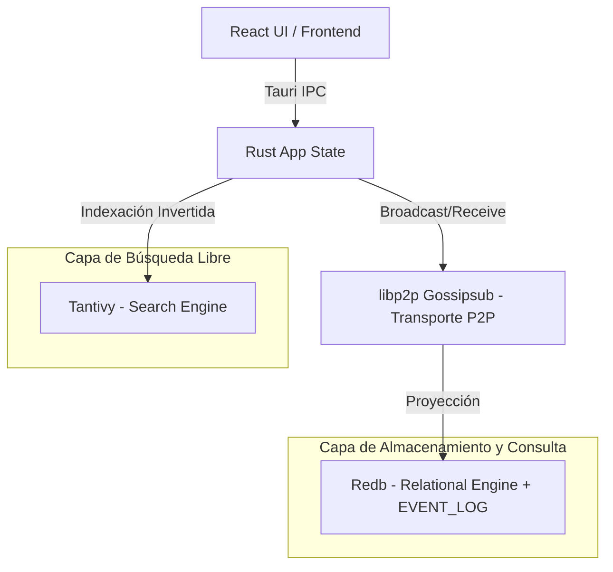

# Motor de Base de Datos

Syntrix implementa una arquitectura de datos descentralizada basada en **Event Sourcing** y **Proyecciones Locales**. La capa de red P2P (libp2p gossipsub) solo transporta eventos; el almacenamiento durable es exclusivamente **redb**.

---

## 1. Arquitectura de Dos Capas

### Capa 1: El Log de Eventos (redb EVENT_LOG + Gossip Broadcast)
- **Persistencia de Eventos**: Toda escritura se guarda como un evento inmutable en la tabla `EVENT_LOG` de redb.
- **Claves**: `evt:{org_id}:{hlc_ts:020}:{hlc_count:08}:{hlc_node}`.
- **Transmisión**: El evento se broadcast al topic gossip de la org inmediatamente después de escribirlo en redb.
- **Hybrid Logical Clocks (HLC)**: Orden causal estricto sin servidor central.

### Capa 2: La Proyección Relacional (Redb)
- **`DOCUMENTS`**: Mapea `doc:{org_id}:{entity}:{doc_id}` → Payload JSON.
- **`INDEXES`**: Índices secundarios: `idx:{org_id}:{entity}:{field}:{encoded_value}:{doc_id}`.
- **`COMPOSITE`**: Índices compuestos: `compidx:{org_id}:{entity}:{name}:{v1_enc}:...:{doc_id}`.
- **`HLC_TRACKER`**: Último HLC por doc: `hlc:{org_id}:{entity}:{doc_id}` → `{ ts, count, node }`.
- **`MEMBERS`**: Miembros de org: `members:{org_id}:{node_id}` → `{ active, role, person, name, device_addr }`.
- **`ROLES`**: Roles de org: `roles:{org_id}:{role_name}` → `{ can_open, can_write }`.
- **`HEARTBEATS`**: Heartbeats: `heartbeat:{org_id}:{node_id}` → `{ ts, status }`.

### Capa 3: Búsqueda de Texto Completo (Tantivy)
- Índice invertido local. Solo campos `#[searchable]` son indexados.

---

## 2. Ciclo de Vida de las Mutaciones

| Operación | redb (Almacenamiento Local) |
|---|---|
| **Crear (Insert)** | `append_event()` en `EVENT_LOG`, `upsert_document()` en `DOCUMENTS`, broadcast gossip |
| **Editar (Update)** | Nuevo evento en `EVENT_LOG`, upsert en `DOCUMENTS` (LWW por HLC), broadcast gossip |
| **Borrar (Delete)` | `delete_document()` en `DOCUMENTS` + índices |

---

## 3. Reconstrucción de Proyecciones

El archivo `syntrix_indexes.redb` y `search_index/` son reconstruibles desde `EVENT_LOG`:

1. Limpiar directorios de redb y Tantivy.
2. Escanear `EVENT_LOG` en orden HLC.
3. Reprocesar cada evento con `upsert_document`.
