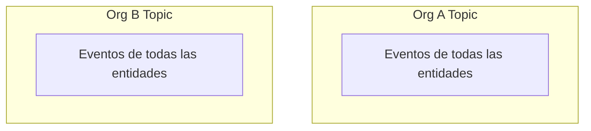

# TopicIds y Autorización

Syntrix utiliza **topics gossip** de libp2p para la comunicación P2P. Cada organización tiene un `TopicId` UUID que aísla su tráfico de red.

---

## 1. Topic por Organización

A diferencia del modelo anterior (múltiples namespaces por entidad), ahora **cada organización tiene un único topic gossip**:



- El `TopicId` es un UUID `[u8; 32]` generado al crear la org.
- Todos los eventos de todas las entidades se transmiten por el mismo topic.
- La entidad se determina del campo `type` del evento (ej: `"customer.created"` → entidad `customers`).
- El aislamiento entre orgs se logra mediante topics separados.

---

## 2. Definición y Estructura de Roles

Las políticas de acceso se almacenan en redb bajo `roles:{org_id}:{role_name}`:

```json
{
  "name": "sales",
  "can_open": ["customers", "products", "invoices", "orders"],
  "can_write": ["customers", "invoices", "orders"]
}
```

La validación es directa:

- `can_open.contains(entity) || can_open.contains("*")` → permiso de lectura
- `can_write.contains(entity) || can_write.contains("*")` → permiso de escritura

Roles predeterminados:
- **`admin`**: `["*"]` en ambos campos — acceso total.
- **`sales`**: Lectura en customers, products, invoices, orders; escritura en customers, invoices, orders.
- **`contabilidad`**: Solo lectura en invoices, customers.

---

## 3. Validación de Escritura en Eventos Remotos

Cada evento gossip recibido de un peer remoto pasa por validación de permisos antes de ser indexado:

1. El `hlc.node` del evento identifica al autor (primeros 16 chars de su PublicKey hex).
2. Se busca el rol del autor en redb `MEMBERS`.
3. Se verifica `can_write(entity)` para el rol del autor.
4. Si no tiene permiso, el evento se descarta.

---

## 4. Migración desde Namespaces

| Concepto Anterior | Equivalente Nuevo |
|---|---|
| NamespaceId por entidad (anterior) | TopicId (libp2p gossipsub) por organización |
| accept_cb a nivel de doc | Validación por evento en receive loop |
| `doc.set_bytes()` para escribir | `gossip.broadcast()` + redb `EVENT_LOG.append` |
| `doc.get_many()` para leer | redb `EVENT_LOG.query_events_since()` |
| `doc.subscribe()` para eventos remotos | `GossipTopic` stream de `Event::Received` |
