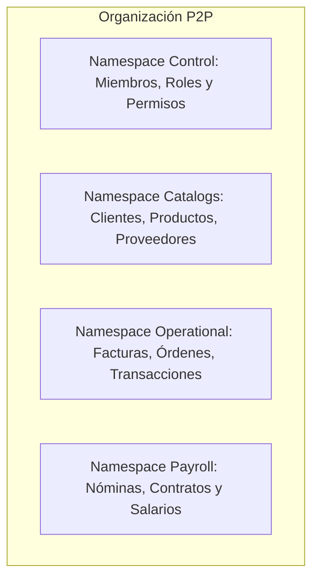
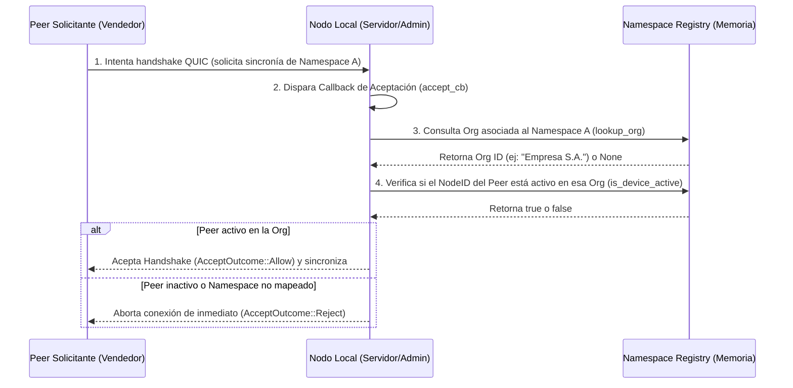

# Estructura de Namespaces y Autorización

Syntrix no utiliza una única base de datos global. En su lugar, el modelado y aislamiento de los datos se estructura en **Namespaces** (espacios de nombres criptográficos). Cada namespace es un almacén clave-valor aislado, protegido por llaves públicas/privadas de Iroh y cifrado de extremo a extremo (E2EE).

---

## 1. Los 4 Namespaces Core de una Organización

Para asegurar que un usuario solo tenga acceso físico y de sincronización a los datos que le corresponden por su puesto, la información de una organización se segrega en 4 namespaces:



### Namespace 1: Control (`control_id`)
- **Propósito**: Contiene los metadatos core de la organización, la lista de miembros autorizados, sus roles, configuraciones del espacio y políticas de permisos de red.
- **Ruta de Claves**:
  - `org`: Metadatos generales de la organización (`{"name": "Empresa S.A.", "created_at": "..."}`).
  - `members/<node_id_hex>`: Información del dispositivo del miembro, incluyendo estado activo, rol y dirección de red.
  - `roles/<role_name>`: Especifica los permisos exactos del rol (`can_open` y `can_write` por módulo).
  - `heartbeat/<node_id_hex>`: Registros dinámicos de presencia.

### Namespace 2: Catalogs (`catalogs_id`)
- **Propósito**: Almacena datos operativos maestros que no son confidenciales pero son necesarios para operar a diario.
- **Entidades**: Catálogo de productos, lista de clientes, proveedores y catálogo de cuentas contables.

### Namespace 3: Operational (`operational_id`)
- **Propósito**: Registra las actividades y operaciones comerciales transaccionales de la empresa.
- **Entidades**: Facturas de venta/compra, órdenes de servicio, cotizaciones y movimientos físicos de inventario.

### Namespace 4: Payroll (`payroll_id`)
- **Propósito**: Datos sensibles de carácter privado y restringido.
- **Entidades**: Nóminas de empleados, salarios, contratos y logs de auditoría de nómina.

---

## 2. Definición y Estructura de Roles

Las políticas de acceso a los módulos y namespaces se definen en el namespace de **Control** en formato JSON bajo las claves `roles/<nombre_rol>`. Un ejemplo típico de estructura JSON es el siguiente:

```json
// roles/sales
{
  "can_open": ["customers", "products", "invoices", "orders"],
  "can_write": ["customers", "invoices", "orders"]
}
```

El sistema cuenta con tres roles predeterminados parametrizados en el backend nativo:
- **`admin`**: Acceso total de lectura y escritura en todos los namespaces (`*`).
- **`sales` (Ventas)**: Lectura en catálogos y operaciones, escritura restringida a clientes y facturación. Sin acceso al namespace de **Payroll**.
- **`contabilidad`**: Lectura contable de facturas y catálogos. Sin acceso de escritura operativa.

---

## 3. Autorización Activa a Nivel de Red (`accept_cb`)

En Syntrix, la seguridad no se limita a ocultar botones en la interfaz gráfica del frontend. La seguridad se implementa de manera activa y criptográfica en la capa de transporte P2P en Rust a través de un callback de aceptación personalizado (`accept_cb`) en el crate `syntrix-core`.

Cuando un dispositivo externo (Peer) intenta conectarse e iniciar la sincronización de un namespace de datos:



### Mecanismo de Validación Criptográfica
1. **Identidad del Peer**: El `NodeId` del peer remoto es su clave pública de Iroh (32 bytes). Esta identidad es inalterable e imposible de falsificar gracias a las firmas criptográficas de QUIC/TLS 1.3.
2. **Mapeo de Namespaces**: El nodo local registra dinámicamente qué namespaces pertenecen a qué organización en el registry.
3. **Consulta de Membresía**: El callback busca de forma instantánea en memoria si el `NodeId` es un dispositivo activo en la organización propietaria (`registry.is_device_active`).
4. **Validación**: Si no está registrado o figura como inactivo, **el flujo de red se cancela de forma inmediata**, impidiendo la descarga de un solo byte de datos.

