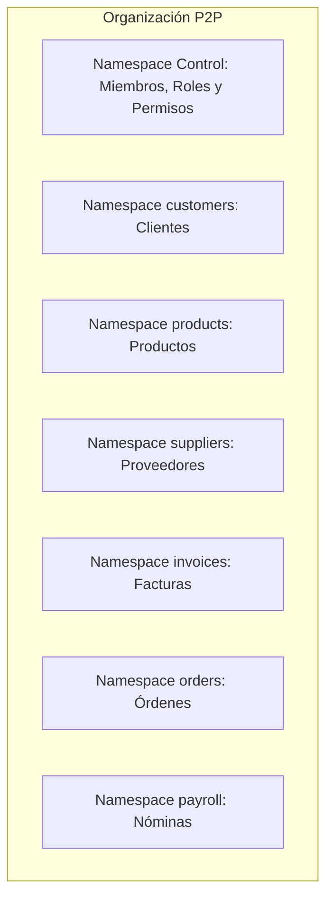
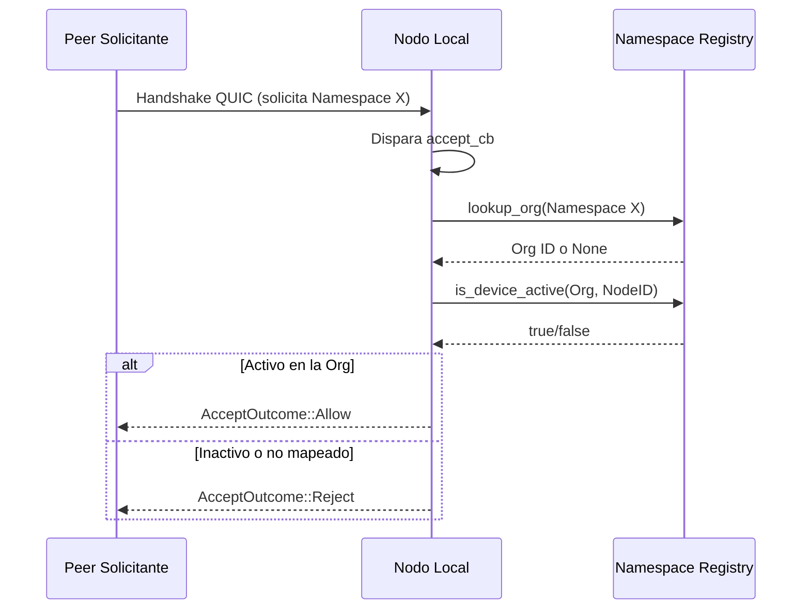

# Namespaces y Autorización

Syntrix no utiliza una única base de datos global. En su lugar, los datos se organizan en **namespaces criptográficos** de Iroh. Cada namespace es un almacén clave-valor aislado, protegido por llaves públicas/privadas y cifrado de extremo a extremo (E2EE).

---

## 1. Namespaces por Entidad

A diferencia de un modelo con pocos namespaces compartidos, Syntrix asigna **un namespace de Iroh por cada entidad del sistema**. Esto da un aislamiento más granular y evita que un dispositivo sincronice datos de entidades para las que no tiene permiso.



### Namespace de Control (`control_id`)
- **Propósito**: Contiene los metadatos core de la organización, miembros autorizados, roles y políticas de permisos.
- **Ruta de Claves**:
  - `org`: Metadatos generales (`{"name": "Empresa S.A.", "created_at": "..."}`).
  - `members/<node_id_hex>`: Dispositivos miembros con estado activo, rol y dirección de red.
  - `roles/<role_name>`: Permisos del rol (`can_open` y `can_write` por nombre de entidad).
  - `heartbeat/<node_id_hex>`: Registros dinámicos de presencia.

### Namespaces de Entidad (`customers`, `products`, `invoices`, etc.)
- Cada entidad definida en el registry de esquemas tiene su propio namespace.
- Solo los dispositivos cuyo rol incluye la entidad en `can_open` pueden sincronizar ese namespace.
- Esto permite, por ejemplo, que un vendedor tenga acceso a `customers` e `invoices` pero no a `payroll`.

---

## 2. Definición y Estructura de Roles

Las políticas de acceso se definen en el namespace de **Control** bajo `roles/<nombre_rol>`:

```json
{
  "can_open": ["customers", "products", "invoices", "orders"],
  "can_write": ["customers", "invoices", "orders"]
}
```

Los campos `can_open` y `can_write` contienen **nombres de entidad directamente** (o `"*"` para todo acceso). No existe una capa intermedia de "namespace de agrupación". La validación es directa:

- `can_open.contains(entity) || can_open.contains("*")` → permiso de lectura
- `can_write.contains(entity) || can_write.contains("*")` → permiso de escritura

Roles predeterminados:
- **`admin`**: `["*"]` en ambos campos — acceso total.
- **`sales`**: Lectura en customers, products, invoices, orders; escritura en customers, invoices, orders.
- **`contabilidad`**: Solo lectura en invoices, customers.

---

## 3. Autorización Activa a Nivel de Red (`accept_cb`)

La seguridad no se limita a ocultar botones en la UI. Se implementa en la capa de transporte P2P mediante un callback de aceptación (`accept_cb`) en `syntrix-core`.

Cuando un dispositivo remoto intenta sincronizar un namespace:



### Flujo de Validación
1. **Identidad**: El `NodeId` del peer es su clave pública Iroh (32 bytes), inalterable por QUIC/TLS 1.3.
2. **Mapeo**: Cada namespace se registra dinámicamente a su organización en el `NamespaceRegistry`.
3. **Membresía**: Se verifica si el `NodeId` es un dispositivo activo en la organización propietaria.
4. **Decisión**: Si no está registrado o está inactivo, la conexión se rechaza antes de transferir datos.

---

## 4. Validación de Escritura

Además del control de acceso a nivel de red, cada escritura pasa por `can_write()` en el `NamespaceRegistry`. Esto evita que un dispositivo con acceso de solo lectura intente modificar datos a través del namespace que tiene abierto.

```rust
// registry.rs
pub fn can_write(&self, org_id: &OrgId, node_id: &NodeId, namespace: &str) -> bool {
    can_write.iter().any(|n| n == "*" || n == namespace)
}
```
