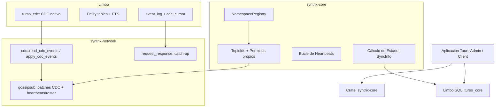

# Sincronización P2P y CDC

La arquitectura de comunicación colaborativa de Syntrix utiliza **libp2p gossipsub** para
pub/sub de cambios CDC, **libp2p request_response** para catch-up, y **Limbo (turso_core)**
como único almacenamiento local SQL con CDC nativo. El transporte de sincronización de datos
de entidad es **CDC-nativo**: ya no se retransmiten eventos JSON de negocio por gossip como
mecanismo principal — se lee `turso_cdc` y se envían los cambios reales de fila.

---

## 1. La Pila de Crates P2P en Syntrix



*   **`syntrix-core`**: proporciona `NamespaceRegistry` (mapeo TopicId → OrgId, permisos de
    roles) y re-exporta el registro de columnas (`syntrix-network::schema`) como
    `syntrix_core::schema`. En el cliente, el `NamespaceRegistry` solo conoce con certeza **su
    propio** dispositivo/rol — el permiso de autores remotos se valida contra las tablas SQL
    `members`/`roles` (ver sección 6), no contra el registro en memoria.
*   **Limbo (turso_core)**: motor SQL embebido con CDC nativo via
    `PRAGMA capture_data_changes_conn='full'`. Tablas: `customers`, `suppliers`, `products`,
    `invoices`, `orders`, `payroll` (+ tablas hijas `invoice_items`/`order_items`), más tablas
    de sistema `event_log`, `members`, `roles`, `heartbeats`, `cdc_cursor`.
*   **`syntrix-network`**: expone `cdc::{read_cdc_events, apply_cdc_events, CdcEvent}` (el
    núcleo del transporte CDC-nativo) y dos protocolos libp2p:
    - **gossipsub**: batches de `CdcEvent` (`{"kind":"cdc_batch","events":[...]}`),
      heartbeats, y eventos de roster (`device.updated`/`role.updated`).
    - **request_response** (catch-up): snapshot histórico + roster completo de
      dispositivos/roles para peers que se unen o se reconectan.

---

## 2. Flujo de escritura local (commit_event)

1. Validar `can_write` del rol propio contra la entidad del evento (chequeo local, usando el
   rol conocido de este mismo nodo).
2. Generar HLC timestamp (ts + count monotónico por nodo).
3. Escribir el evento en el `event_log` local del cliente (histórico informativo, ya no es
   transporte).
4. Proyectar el documento en columnas tipadas de la tabla de entidad (+ tablas hijas si
   aplica) vía `SqlEngine::upsert_document_full`, usando `change_time`/`node_id` reales.
5. Notificar `LiveManager` para re-ejecutar queries activas.
6. **No** se publica el evento directamente por gossip. El cambio queda registrado en
   `turso_cdc` (por el `PRAGMA capture_data_changes_conn`) y será recogido y publicado por el
   loop de CDC (sección 3) en su próximo tick.

---

## 3. Sincronización CDC (Change Data Capture) — transporte principal

### Captura local (turso_cdc)

Limbo expone CDC nativo via `PRAGMA capture_data_changes_conn='full'`. Esto crea la tabla
`turso_cdc`, que captura automáticamente todo INSERT/UPDATE/DELETE como un blob de registro
binario estándar (mismo formato que una fila de tabla — decodificable con
`turso_core::types::ImmutableRecord`), con esta forma:

```
turso_cdc
  ├─ change_id     (monotónico, GLOBAL entre todas las tablas con CDC activo)
  ├─ table_name    (NULL para filas de marcador de commit)
  ├─ change_type   (1=insert, 0=update, -1=delete, 2=marcador de commit)
  ├─ change_time   (epoch ms)
  ├─ before        (record binario pre-cambio; NULL en insert)
  └─ after         (record binario post-cambio; NULL en delete)
```

`syntrix_network::cdc::read_cdc_events()` consulta `turso_cdc` desde un `change_id` dado,
filtrando por tabla física (entidad o tabla hija), decodifica el blob `after` (o `before` para
deletes) posicionalmente según el orden de columnas de `schema.json`, y descarta las filas de
marcador de commit (`change_type == 2`).

### Push CDC (nodo local → peers)

`apps/client/src-tauri/src/cdc_sync.rs::run_cdc_publish_loop` corre cada 2 segundos por
defecto:

1. Lee el cursor persistido (`cdc_cursor.last_change_id`) para cada org conocida.
2. Llama a `read_cdc_events(conn, cursor, limit, None)` (todas las tablas físicas).
3. Filtra los eventos que pertenecen a esa org (`turso_cdc.change_id` es una secuencia global
   compartida entre orgs en la misma base de datos).
4. Si hay eventos, los publica como `{"kind":"cdc_batch","events":[CdcEvent...]}` en el topic
   gossip de la org.
5. Persiste el nuevo cursor (`set_cdc_cursor`), avance con o sin eventos para esa org.

### Recepción (peer remoto)

`identity.rs::apply_cdc_batch` (cliente) / `gossip.rs::apply_cdc_batch` (admin):

1. Deserializa el batch `Vec<CdcEvent>`.
2. Para cada evento, valida que el autor (`node_id` embebido en la fila) tenga permiso de
   escritura sobre la entidad — ver sección 6.
3. Llama a `syntrix_network::cdc::apply_cdc_events`, que aplica LWW por `change_time` (sección
   7), hace `INSERT OR REPLACE` tipado o `DELETE` (con cascada a tablas hijas en deletes de
   entidad padre).
4. (Admin) Registra cada evento aceptado como fila de auditoría en `event_log`
   (`entity`/`change_type`/`doc_id`/`row_image`/`change_time`/`node_id`).

---

## 4. Catch-up P2P

Cuando un nodo se une a una org (o se reconecta tras un reinicio), solicita catch-up al admin
antes de continuar con el procesamiento normal:

1. `crate::catchup::request_catchup(p2p, peer_id, org_id, since_hlc, indexer)` pide un
   snapshot al admin via request_response.
2. El admin responde con una lista mixta de items:
   - Un **roster completo** de `device.updated`/`role.updated` para todos los dispositivos y
     roles conocidos de la org (necesario para que el peer pueda validar permisos de autor de
     eventos CDC recibidos de *cualquier* otro peer, no solo del admin — ver sección 6).
   - Un item `{"kind":"cdc_batch","events":[CdcEvent...]}` con un **snapshot relacional**:
     `syntrix_network::cdc::snapshot_org_rows()` lee el estado *actual* de todas las
     tablas de entidad/hijas para esa org (no un replay histórico) y lo codifica como
     `CdcEvent`s (`change_type = 1`, con el `change_time`/`node_id` real de cada fila).
3. `catchup::apply_catchup_event` procesa cada item: roster → `members`/`roles` SQL;
   `cdc_batch` → `syntrix_network::cdc::apply_cdc_events` (el mismo código usado para CDC en
   vivo, así que catch-up y sync en vivo comparten idénticas reglas de LWW y validación de
   permisos). El admin envía el roster **antes** del snapshot en la lista, para que
   `apply_cdc_events` ya pueda validar el autor de cada fila del snapshot.
4. Si la solicitud al admin falla (offline), se reintenta contra un peer visto recientemente
   en `heartbeats`.

> **Nota histórica**: una primera versión de catch-up reproducía el `event_log` como una lista
> de eventos JSON con HLC (`upsert_document_with_hlc` + una tabla `hlc_tracker` para
> deduplicación). Ese diseño quedó roto en cuanto `event_log` del admin pasó a ser
> exclusivamente auditoría de datos (Decisión 5) — `row_image` ya no tiene la forma
> `{type, hlc, payload}` que ese replay esperaba, así que un peer nuevo no recibía datos
> históricos. El snapshot relacional (punto 2) reemplaza ese enfoque por completo; `LWW` para
> filas de entidad se decide únicamente por `change_time` de columna (sección 7),
> `upsert_document_with_hlc`/`hlc_tracker` fueron eliminados.

---

## 5. Heartbeats

Cada nodo escribe un heartbeat cada 15s:

- Formato JSON: `{ ts, status: "online", node_id }`.
- Almacenado en Limbo `heartbeats`.
- Leído por `get_sync_info` para determinar peers online/offline, y como respaldo para
  localizar un peer con quien reintentar catch-up si el admin no responde.

---

## 6. Autorización por Autor de Evento

La autorización se valida **por cada evento CDC recibido**, no solo al escribir localmente:

1. Cada fila CDC lleva su propio `node_id` (el autor original de la escritura, capturado en la
   columna `node_id` de la tabla en el momento de `commit_event`).
2. El receptor valida el permiso del autor contra su copia local de `members`/`roles`
   (`SqlEngine::can_node_write`, cliente; `NamespaceRegistry` completo, admin — el admin es
   autoritativo porque emite él mismo cada `device.updated`/`role.updated`).
3. **Importante**: el `NamespaceRegistry` en memoria de un *cliente* solo contiene su propio
   dispositivo (nunca aprende sobre otros peers vía ese registro) — por eso la validación en
   el cliente usa las tablas SQL `members`/`roles`, pobladas por gossip de roster
   (`device.updated`/`role.updated`) y por el snapshot de catch-up (sección 4).
4. Si el autor no tiene permiso, el evento se descarta silenciosamente (no se aplica, no se
   audita).

---

## 7. Resolución Last-Write-Wins (LWW)

CDC usa LWW por `change_time` (epoch ms, no HLC) para resolver conflictos:

1. **Por fila**: cada fila de entidad o de tabla hija tiene su propio `change_time` vigente
   (clave: `(org_id, doc_id)` para entidades; `(org_id, parent_id, line_id)` para hijas).
2. **Aplicación de CDC**: `apply_cdc_events` compara `CdcEvent.change_time` contra el
   `change_time` almacenado en la fila local. Si el almacenado es `>=` al entrante, el evento
   se descarta (no se sobreescribe).
3. **Deletes**: un evento con `change_type == -1` es un delete real (no un marcador de
   commit); se aplica como `DELETE` tras pasar el chequeo LWW, y si la fila es una entidad con
   tablas hijas declaradas, se hace cascada explícita de borrado a esas tablas hijas (defensivo
   ante reordenamiento de red).
4. **Catch-up**: el snapshot relacional (sección 4) se aplica con el mismo `apply_cdc_events`
   y el mismo chequeo LWW por `change_time` — no hay un camino de escritura remota separado.
   `change_time` de cada fila es la única fuente de verdad de LWW; no existe una tabla
   `hlc_tracker` ni un `upsert_document_with_hlc` independiente.

---

## 8. Compatibilidad de Versiones de Esquema

1. **Forward-only**: las migraciones de esquema solo pueden ADD columnas, nunca DROP o
   RENAME, para que peers con esquemas más nuevos puedan leer datos de peers más viejos.
2. **Columnas desconocidas se ignoran**: si `read_cdc_events`/`apply_cdc_events` encuentra un
   row-image con menos columnas de las que el `schema.json` local espera para esa tabla, la
   fila se descarta en vez de desalinear columnas.
3. **Upcasters deterministas** (solo en el path de escritura local, `events.rs`): al comitear
   un evento de negocio con `schema_version` menor a la actual, se ejecuta `upcast_payload()`
   antes de proyectar a columnas tipadas.
4. Los eventos de negocio (`commit_event`) siguen llevando `schema_version` en su metadata,
   pero ese payload ya no viaja directamente por la red — solo se usa localmente para decidir
   el upcast antes de escribir en columnas.
