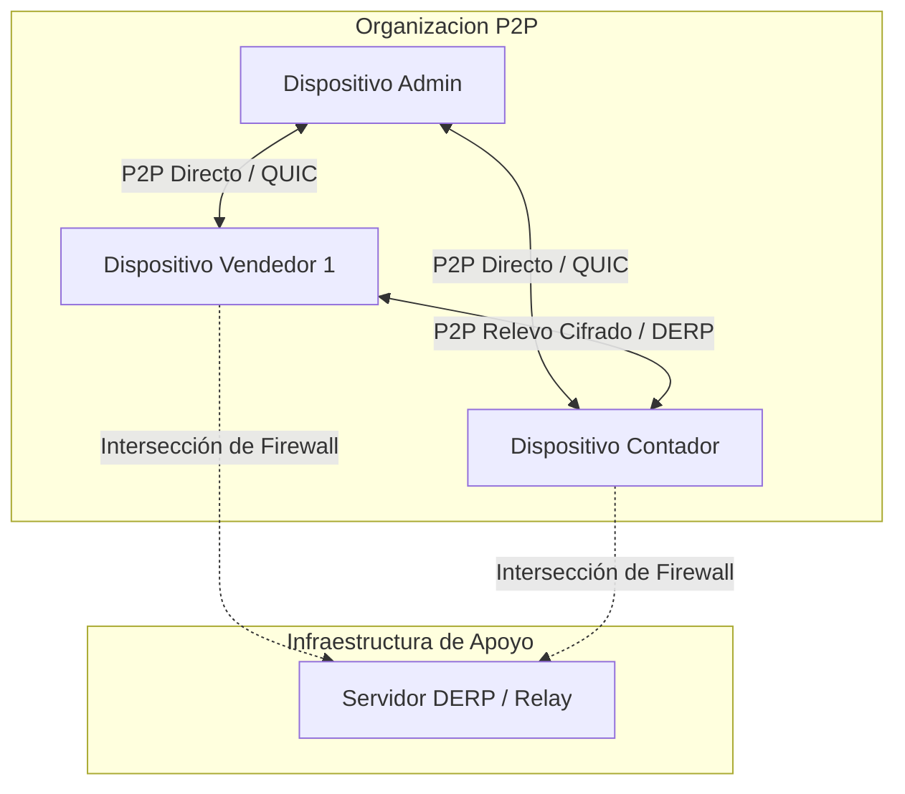

# Sincronización P2P (Iroh)

La red descentralizada y colaborativa de Syntrix se construye sobre el ecosistema de **Iroh** (utilizando `iroh-docs`, `iroh-blobs` y `iroh-gossip`). Esta pila permite que múltiples nodos colaboren en tiempo real de forma segura y mantengan sus datos sincronizados de manera eventual y transparente, incluso cuando operan completamente desconectados de internet.

---

## 1. Topología de Red y Conectividad

A diferencia de los sistemas cliente-servidor clásicos, Syntrix no se comunica con una base de datos centralizada. En su lugar, cada dispositivo es un nodo autónomo en la red.

### Protocolos de Conexión y Transporte
1. **QUIC como Protocolo Core**: Toda comunicación entre nodos utiliza QUIC sobre UDP. Esto proporciona conexiones cifradas por defecto (TLS 1.3), flujos de datos multiplexados e inicio de conexión ultrarrápido.
2. **Hole Punching**: Los nodos intentan establecer una conexión directa (peer-to-peer) mediante técnicas de hole punching.
3. **Servidores DERP (Relay)**: Si ambos dispositivos se encuentran detrás de firewalls corporativos estrictos o redes móviles con NAT simétrico, el tráfico se triangula a través de un servidor de relevo (DERP). Dado que el cifrado es de extremo a extremo (E2EE), el servidor DERP solo retransmite paquetes sin descifrar el contenido.

---

## 2. Los Componentes del Protocolo de Sincronización

### A. Replicación de Documentos (`iroh-docs`)
`iroh-docs` proporciona la estructura para sincronizar un log inmutable de clave-valor. Cuando dos nodos se conectan, realizan un intercambio de metadatos (handshake) e identifican qué entradas del log les faltan. Los cambios pendientes se replican a través de flujos QUIC eficientes.

### B. Transferencia de Blobs (`iroh-blobs`)
Cuando un documento JSON en `iroh-docs` excede el tamaño del valor directo o hace referencia a archivos (como fotos de facturas, PDFs o blobs de datos pesados), `iroh-docs` almacena solo el hash criptográfico del contenido (el `Hash` de Iroh). La transferencia real del contenido se delega a `iroh-blobs`, que transmite los datos dividiéndolos en fragmentos verificados criptográficamente mediante árboles de Merkle (Bao), garantizando transferencias óptimas, reanudables y seguras.

### C. Protocolo de Gossip (`iroh-gossip`)
Se utiliza para la mensajería instantánea e intercomunicación dinámica en tiempo real. Cuando ocurre una mutación local, el nodo emite un evento de gossip a todos los peers conectados de la organización, permitiendo que las proyecciones relacionales y la UI del resto de los dispositivos se actualicen en milisegundos sin esperar a la reconciliación periódica.

---

## 3. Reconciliación eventual y mitigación de conflictos

Dado que los nodos operan de forma local y asíncrona, es inevitable que se realicen modificaciones simultáneas del mismo registro sin conectividad activa. Syntrix resuelve y mitiga esto a nivel de base de datos P2P mediante los siguientes mecanismos:

### A. Reconciliación Automática (Handshake)
Cuando un nodo recupera la conectividad de red:
1. Detecta la presencia de peers activos en la organización mediante el canal de Gossip.
2. Inicia un proceso de sincronía activa (`start_sync`) apuntando a las direcciones físicas resueltas de los peers.
3. `iroh-docs` reconcilia el historial de eventos ausentes, descargando en ráfaga las entradas faltantes.

### B. Política Last-Write-Wins (LWW) y Reloj Causal HLC
Para evitar inconsistencias en el orden de los eventos cuando los dispositivos tienen desajustes de hora locales:
- Cada evento lleva asociado un sello de tiempo de **Hybrid Logical Clock (HLC)**.
- Un HLC combina la hora del sistema físico del dispositivo local con un contador lógico que se incrementa monóticamente si ocurren múltiples eventos en el mismo microsegundo.
- Si dos nodos modifican la misma entidad, prevalecerá la mutación que tenga el HLC causalmente más avanzado, manteniendo un estado determinista y consistente en todos los dispositivos tras converger la sincronización.

---

## 4. Robustez de la Red y Resiliencia ante Desconexiones

Para garantizar el funcionamiento continuo bajo condiciones de red inestables, Syntrix implementa:

1. **Re-sincronizaciones Periódicas Activas**: El backend ejecuta un bucle en segundo plano que periódicamente realiza consultas activas a las direcciones de red conocidas de los peers registrados en el namespace **Control**, asegurando que los handshakes se ejecuten incluso si los eventos de Gossip se pierden por caídas de red temporales.
2. **Latido de Presencia (Heartbeat)**: Cada dispositivo activo registra una clave temporal `heartbeat/<node_id_hex>` con un timestamp actualizado periódicamente en el namespace de Control. Esto permite a los otros miembros conocer de forma precisa el total de dispositivos online y calcular denominadores exactos de sincronización.
3. **Manejo de Re-conexiones y Backoff**: Los intentos de conexión directa a peers caídos implementan políticas de reintento exponencial (exponential backoff) para evitar sobrecargar los hilos de red y conservar el uso de batería y CPU en los dispositivos.
