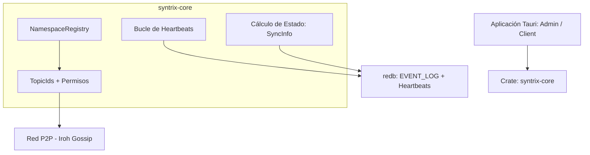

# Sincronización P2P y Seguridad de Red (Iroh Gossip)

La arquitectura de comunicación colaborativa de Syntrix elimina la dependencia de `iroh-docs` y `iroh-blobs`. En su lugar, el sistema utiliza **`iroh-gossip`** para pub/sub de eventos y **redb** como único almacenamiento local persistente.

---

## 1. La Pila de Crates P2P en Syntrix

*   **`syntrix-core`**: Proporciona `NamespaceRegistry` (mapeo TopicId → OrgId, permisos de roles), heartbeats sobre gossip + redb, y cálculo de estado de peers.
*   **`iroh-gossip`**: Reemplaza `iroh-docs` como capa de transporte. Cada org tiene un `TopicId` UUID. Los eventos se transmiten via `broadcast(Bytes)` y se reciben via `Event::Received(Message)`.
*   **redb**: Almacenamiento único. Tablas `EVENT_LOG`, `MEMBERS`, `ROLES`, `HEARTBEATS`, `DOCUMENTS`, `INDEXES`.

---

## 2. Flujo de Datos

### Escritura local (commit_event)
1. Validar `can_write` del rol contra la entidad del evento.
2. Generar HLC timestamp.
3. Escribir evento en redb `EVENT_LOG`.
4. Proyectar documento en `DOCUMENTS` + `INDEXES`.
5. Broadcast del evento serializado al topic gossip de la org.

### Recepción remota (gossip Received)
1. Validar que el sender es un miembro activo conocido (redb `MEMBERS`).
2. Validar que el rol del sender tiene `can_write` para la entidad del evento.
3. Validar HLC > HLC existente para el mismo doc_id (LWW).
4. Escribir en `EVENT_LOG` + proyectar en `DOCUMENTS` + `INDEXES`.

---

## 3. Catch-up P2P

Cuando un nuevo nodo se une a una org, completa catch-up antes de procesar eventos gossip en vivo:

1. Se suscribe al topic gossip.
2. Conecta al admin via `endpoint.connect()` con ALPN `/syntrix/catchup/1`.
3. Envía `{ org_id, since_hlc: 0 }`.
4. Admin responde con todos los eventos desde `since_hlc`.
5. Los eventos recibidos se proyectan en redb.
6. Se reanuda el procesamiento normal de gossip.

---

## 4. Heartbeats

Cada nodo escribe un heartbeat cada 15s:
- Formato JSON: `{ ts, status: "online", node_id }`
- Almacenado en redb `HEARTBEATS`.
- Leído por `get_sync_info` para determinar peers online/offline.

---

## 5. Autorización por Evento

A diferencia del modelo anterior (accept_cb a nivel de doc), la autorización ahora se valida **por cada evento recibido**:

1. El `NamespaceRegistry` mantiene devices activos y roles con `can_write`.
2. Cuando un evento llega via gossip, se verifica que el sender (identificado por `hlc.node`) tenga `can_write` para la entidad del evento.
3. Si no tiene permiso, el evento se descarta (nunca se indexa en redb).
