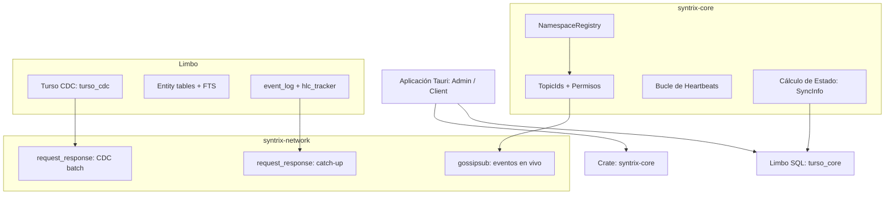

# Sincronización P2P y CDC

La arquitectura de comunicación colaborativa de Syntrix utiliza **libp2p gossipsub** para pub/sub de eventos en vivo, **libp2p request_response** para transferencia batch de CDC y catch-up, y **Limbo (turso_core)** como único almacenamiento local SQL con CDC nativo.

---

## 1. La Pila de Crates P2P en Syntrix



*   **`syntrix-core`**: Proporciona `NamespaceRegistry` (mapeo TopicId → OrgId, permisos de roles), heartbeats sobre gossip + Limbo, y cálculo de estado de peers.
*   **Limbo (turso_core)**: Motor SQL embebido con CDC nativo via `PRAGMA capture_data_changes_conn='full'`. Tablas: `customers`, `suppliers`, `products`, `invoices`, `orders`, `payroll`, más tablas de sistema `event_log`, `members`, `roles`, `heartbeats`, `hlc_tracker`.
*   **`syntrix-network`**: Maneja dos protocolos de sincronización sobre libp2p:
    - **gossipsub** (`/syntrix/1.0.0`): transmisión en vivo de eventos firmados con HLC.
    - **request_response** (`/syntrix/catchup/1`, `/syntrix/cdc/1`): transferencia batch de catch-up histórico y cambios CDC.

---

## 2. Flujo de Datos — Gossip en Vivo

### Escritura local (commit_event)
1. Validar `can_write` del rol contra la entidad del evento (`NamespaceRegistry`).
2. Generar HLC timestamp (ts + count monotónico por nodo).
3. Escribir evento en Limbo `event_log`.
4. Proyectar documento en tabla de entidad + `FTS`.
5. Notificar `LiveManager` para re-ejecutar queries activas.
6. Broadcast del evento serializado al topic gossip de la org.

### Recepción remota (gossip Received)
1. Validar que el sender es un miembro activo conocido (Limbo `members`).
2. Validar que el rol del sender tiene `can_write` para la entidad del evento.
3. Validar HLC > HLC existente para el mismo `doc_id` (LWW — ver sección 6).
4. Escribir en `event_log` + proyectar en tabla de entidad + `FTS`.
5. Notificar `LiveManager` para actualizar suscripciones activas.

---

## 3. Sincronización CDC (Change Data Capture)

Además del gossip en vivo, Syntrix sincroniza cambios a través de CDC nativo de Limbo. Esto asegura que ningún cambio se pierda incluso si el nodo estuvo offline durante un evento gossip.

### Captura local (turso_cdc)

Limbo expone CDC nativo via `PRAGMA capture_data_changes_conn='full'`. Esto crea la tabla virtual `turso_cdc` que captura automáticamente todo INSERT/UPDATE/DELETE en las tablas registradas:

```
catalog/changes/┐
               ├─ change_id (monotónico)
               ├─ table_name
               ├─ change_type (1=INSERT, 2=DELETE, 3=UPDATE)
               ├─ row_id (rowid interno)
               ├─ after (JSON con valores posteriores)
               └─ change_time (epoch ms)
```

El módulo `syntrix-network::cdc::read_cdc_events()` consulta `turso_cdc` desde un `change_id` dado, mapea los cambios crudos a `CdcEvent` con campos de aplicación (`org_id`, `entity`, `doc_id`, `payload`, `change_time`, `node_id`, `change_type`).

### Push CDC (nodo local → peer remoto)

Cada 30 segundos (o inmediatamente después de una escritura local), el nodo hace lecturas incrementales de `turso_cdc`:

1. Leer `turso_cdc` desde el último `change_id` procesado.
2. Agrupar eventos por `(org_id, entity, doc_id)` — solo el último cambio por documento es relevante.
3. Enviar lote de `CdcEvent` al peer via libp2p request_response protocol `/syntrix/cdc/1`.
4. El peer receptor aplica LWW (sección 6) y descarta eventos cuyo `change_time` sea ≤ al almacenado localmente.

### Pull CDC (catch-up diferencial)

Cuando un nodo se reconecta tras una desconexión:

1. Consulta el `max_change_id` del peer remoto via request_response.
2. Si el peer remoto tiene cambios más recientes, envía `pull_cdc_changes(since=last_local_change_id)`.
3. El peer responde con todos los `CdcEvent` desde ese punto.
4. Se aplican con LWW y se actualiza el watermark local.

### CDC vs. Gossip

| Aspecto | Gossip | CDC |
|---------|--------|-----|
| Latencia | Milisegundos (en vivo) | ~30s (batch) |
| Confiabilidad | Depende del mesh | Garantizado por CDC en base de datos |
| Cobertura | Eventos actuales | Cambios desde cualquier punto en el tiempo |
| Uso | Sincronización en vivo | Reconciliación offline + bootstrapping |
| Protocolo | Pub/sub (gossipsub) | Request/response |

---

## 4. Catch-up P2P

Cuando un nuevo nodo se une a una org, completa catch-up antes de procesar eventos gossip en vivo:

1. Se suscribe al topic gossip de la org.
2. Conecta al admin via `endpoint.connect()` con ALPN `/syntrix/catchup/1`.
3. Envía `{ org_id, since_hlc: 0 }`.
4. Admin responde con todos los eventos desde `since_hlc` (desde `event_log`).
5. Los eventos recibidos se proyectan en Limbo (tablas de entidad + `FTS`).
6. Se reanuda el procesamiento normal de gossip.
7. Adicionalmente, se ejecuta un pull CDC para capturar cambios que pudieron haber ocurrido en tablas de entidad directamente (sin pasar por `event_log`).

---

## 5. Heartbeats

Cada nodo escribe un heartbeat cada 15s:

- Formato JSON: `{ ts, status: "online", node_id, schema_version }`
- Almacenado en Limbo `heartbeats`.
- Leído por `get_sync_info` para determinar peers online/offline.
- El campo `schema_version` permite detectar peers con esquema incompatible (ver sección 8).

---

## 6. Autorización por Evento

A diferencia del modelo anterior (accept_cb a nivel de doc), la autorización ahora se valida **por cada evento recibido**:

1. El `NamespaceRegistry` mantiene devices activos y roles con `can_write`.
2. Cuando un evento llega via gossip, se verifica que el sender (identificado por `hlc.node`) tenga `can_write` para la entidad del evento.
3. Si no tiene permiso, el evento se descarta (nunca se indexa en Limbo).
4. Para CDC, la autorización se valida en el lado receptor antes de aplicar `CdcEvent`.

---

## 7. Resolución Last-Write-Wins (LWW)

Tanto gossip como CDC usan LWW para resolver conflictos. Cada evento lleva un `change_time` (epoch ms) que representa el momento lógico del cambio:

### Reglas LWW

1. **Por documento**: cada `(org_id, entity, doc_id)` tiene un único `change_time` vigente.
2. **Escritura local**: si el nuevo evento tiene `change_time > stored.change_time`, se aplica; en caso contrario se descarta.
3. **Recepción remota (gossip)**: se compara el HLC del evento entrante vs. el HLC almacenado en `hlc_tracker`. Si HLC entrante ≤ HLC almacenado, se descarta.
4. **Recepción remota (CDC)**: `apply_cdc_events` compara `CdcEvent.change_time` vs. `stored.change_time` en la tabla de entidad. Si el entrante es menor o igual, el evento se salta.
5. **Empate**: si dos eventos tienen exactamente el mismo `change_time` (caso extremadamente raro), se desempata por `hlc.node` (lexicográfico).
6. **Deletes**: un evento DELETE (change_type=2) en CDC se ignora en la aplicación; los documentos se marcan como eliminados si el payload contiene `_deleted: true`.

### hlc_tracker

La tabla `hlc_tracker` almacena el último HLC visto por `(org_id, entity, doc_id)`:

```sql
CREATE TABLE hlc_tracker (
    org_id TEXT NOT NULL,
    entity TEXT NOT NULL,
    doc_id TEXT NOT NULL,
    hlc_ts INTEGER NOT NULL,
    hlc_count INTEGER NOT NULL,
    hlc_node TEXT NOT NULL,
    PRIMARY KEY (org_id, entity, doc_id)
);
```

Esto permite deduplicación determinista incluso si el mismo evento llega dos veces por rutas diferentes (gossip + CDC).

---

## 8. Compatibilidad de Versiones de Esquema

Syntrix soporta peers con diferentes versiones de esquema. Cada evento incluye `schema_version` en su metadata JSON:

```json
{
  "type": "customer.created",
  "hlc": { "ts": 1719000000000, "count": 0, "node": "a1b2c3d4e5f6..." },
  "schema_version": 2,
  "payload": { "id": "...", "name": "...", "address": { ... } }
}
```

### Reglas de compatibilidad

1. **Forward-only**: las migraciones de esquema solo pueden ADD columnas, nunca DROP o RENAME. Esto asegura que peers con esquemas más nuevos puedan leer datos de peers más viejos.
2. **schema_version en heartbeat**: cada nodo publica su `schema_version` en los heartbeats gossip. Si un peer detecta que otro tiene una versión de esquema que no entiende, puede optar por no sincronizar ciertas tablas.
3. **Upcasters deterministas**: cuando un peer recibe un evento con `schema_version` menor al suyo, ejecuta `upcast_payload()` que aplica una cadena de upcasters (ej: `CustomerV1ToV2` que transforma `address: string` → `address: { street, city }`).
4. **Ignorar columnas desconocidas**: si un peer recibe CDC de una tabla/columna que no existe localmente, el cambio se ignora silenciosamente.
5. **Version negotiation (futuro)**: para breaking changes, se implementará `min_schema_version` en gossip. Peers por debajo de ese mínimo no podrán sincronizar hasta actualizar.

### Implementación

- `syntrix_core::schema_version_for(entity) → u32` retorna la versión actual del esquema para una entidad.
- `syntrix_core::upcast_payload(payload, from_schema, to_schema) → Value` aplica la cadena de transformaciones.
- En el cliente, `upcast_payload()` se llama tanto en `commit_event` como en `sync_push` y en recepción gossip.
- Esto evita corrupción de datos y asegura que todos los peers en el mesh tengan un esquema compatible aunque estén en distintas versiones de software.
