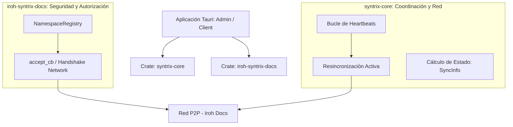

# Sincronización P2P y Seguridad de Red (Iroh)

La arquitectura de comunicación colaborativa de Syntrix elimina la dependencia de un servidor central de base de datos. En su lugar, el sistema se apoya en el ecosistema descentralizado de **Iroh** (`iroh-docs`, `iroh-blobs` y `iroh-gossip`), estructurando la lógica de permisos, red y heartbeats a través de dos crates internos: `iroh-syntrix-docs` y `syntrix-core`.

---

## 1. La Pila de Crates P2P en Syntrix

El comportamiento de red de Syntrix está descentralizado en componentes específicos en el backend en Rust:

*   **`iroh-syntrix-docs`**: Se encarga estrictamente de la seguridad de la red. Determina **quién puede sincronizar** con nosotros y **qué namespaces está autorizado a abrir** un dispositivo remoto.
*   **`syntrix-core`**: Centraliza las primitivas compartidas de sincronización. Maneja la resolución de direcciones físicas (`device_addr`), el bucle de latidos en segundo plano, la re-sincronización periódica y la agregación del estado de los peers para la UI.

---

## 2. Mecánica de Autorización y Permisos (`iroh-syntrix-docs`)

Iroh Docs no cuenta con un sistema de autorización multiusuario integrado por defecto. Para resolver esto, `iroh-syntrix-docs` actúa como un wrapper de autorización criptográfica a nivel de red mediante dos componentes:

### A. El Registro de Namespaces (`NamespaceRegistry`)
Es una estructura de datos en memoria que mantiene mapeada la topología de la organización. Como esta información es en memoria (volátil), cada vez que arranca la aplicación, el nodo lee el namespace de **Control** para reconstruir el registro:

1. Escanea las claves `members/<author_id>` en el namespace de Control para identificar qué llaves públicas son miembros activos de la organización.
2. Escanea las claves `roles/<role_name>` para cargar las políticas de lectura/escritura asociadas.
3. Responde a preguntas críticas del protocolo antes de transferir datos utilizando sus métodos nativos en Rust:
   - *¿Este NodeId remoto es miembro activo de la Org?* $\rightarrow$ `registry.is_device_active(&org_id, &node_id) -> bool`
   - *¿Qué namespaces tiene permitido abrir el peer?* $\rightarrow$ `registry.openable_namespaces(&org_id, &node_id) -> HashSet<String>`
   - *¿Este peer puede escribir en un namespace determinado?* $\rightarrow$ `registry.can_write(&org_id, &node_id, namespace: &str) -> bool`

### B. El Callback de Aceptación de Red (`accept_cb`)
Implementado en `accept.rs` por la función `make_accept_cb`, este callback se inyecta directamente en el inicio del protocolo de transporte de Iroh (`handle_connection` / `spawn`). Cuando un nodo remoto intenta conectarse para replicar información de un namespace:

1. **Firma Criptográfica**: El nodo remoto se identifica utilizando su clave pública de Iroh (`NodeId` / `PublicKey`), firmada criptográficamente por la capa TLS 1.3 de QUIC.
2. **Resolución de la Org**: El callback lee el registry local para buscar a qué organización pertenece el namespace solicitado (`registry.lookup_org(&namespace)`).
3. **Evaluación de Membresía**: Si se encuentra una organización asociada, se comprueba si el peer remoto es un dispositivo miembro activo en ella (`registry.is_device_active(&org_id, peer_bytes)`).
4. **Outcome**:
   - Si el namespace no está mapeado a ninguna Org, o el peer remoto no está registrado o figura como inactivo en ella, **el handshake se aborta inmediatamente** devolviendo `AcceptOutcome::Reject(AbortReason::NotFound)`. No se transfiere un solo byte de datos.
   - Si se encuentra activo y autorizado, se acepta la conexión devolviendo `AcceptOutcome::Allow`.

### C. Filosofía de Revocación de Accesos
*   **Aislamiento posterior**: Si un miembro es desactivado en el namespace de Control (es decir, el administrador cambia el campo `"active": false` en su registro), los peers de la red dejarán de aceptar sus handshakes y no se le transferirá información nueva.
*   **Datos locales residuales**: Dado que es un sistema P2P local, un miembro revocado conservará los datos que ya hubiese descargado físicamente en su disco. Sin embargo, quedará permanentemente aislado y no podrá descargar ni publicar actualizaciones adicionales.

---

## 3. Coordinación y Estado de Presencia (`syntrix-core`)

Mientras que `iroh-syntrix-docs` valida la seguridad, `syntrix-core` se asegura de que el canal de comunicación se mantenga óptimo y provee visibilidad a la interfaz de usuario.

### A. El Bucle de Heartbeats (`start_heartbeat_with_resync`)
Para mantener informados a los peers sobre el estado de la red y forzar la sincronización en topologías NAT/Firewall cambiantes:
1. Cada nodo activo ejecuta un bucle periódico en segundo plano.
2. Escribe de forma recurrente una entrada con formato `heartbeat/<node_id_hex>` en el namespace de **Control** que contiene un timestamp HLC actualizado.
3. Al mismo tiempo, el bucle lee la lista de direcciones físicas activas de los otros miembros de la organización en `members/` y fuerza un intento de sincronización directa (`start_sync`), superando caídas silenciosas en las conexiones de Gossip.

### B. Consolidación de Estado para la UI (`get_sync_info`)
Para pintar la barra de estado de sincronización en el frontend de React, `syntrix-core` expone la función `get_sync_info`, la cual ejecuta el siguiente flujo local:
1. Lee todos los miembros activos registrados en la organización bajo el prefijo `members/`.
2. Lee los heartbeats recibidos en `heartbeat/`.
3. Compara las marcas de tiempo físicas. Si la diferencia de tiempo entre el timestamp actual y el último heartbeat de un peer es menor a **60 segundos**, se determina como `"online"`. En caso contrario, se reporta como `"offline"`.
4. Devuelve un JSON estructurado (`SyncInfo`) que mapea el NodeId de cada dispositivo con su estado en vivo, nombre, rol y dirección física de red.

---

## 4. Reconciliación Eventual y Consistencia Causal (HLC)

En un entorno P2P, no hay bases de datos centralizadas ni sincronía temporal absoluta. Syntrix resuelve este problema de consistencia eventual mediante:

- **Logs Ordenados por HLC**: Cada evento escrito en Iroh Docs tiene una clave `evt:<timestamp_hlc>:<count>:<node_id>`. El **HLC (Hybrid Logical Clock)** asegura un ordenamiento causal de las transacciones. Si hay modificaciones simultáneas sobre una misma entidad en diferentes dispositivos offline, en el momento de la reconexión e intercambio de logs, prevalecerá deterministamente el evento con el HLC causalmente más avanzado.
- **Validación con Firmas de Autor**: Las escrituras de Iroh Docs se firman criptográficamente con el `AuthorId` del dispositivo emisor. El callback `accept_cb` comprueba que la firma de autor corresponda con el NodeId autorizado para escribir en el namespace destino, previniendo que un vendedor inyecte datos fraudulentos en el namespace de nóminas o contabilidad.
- **Árboles de Merkle (Bao) en Blobs**: Toda transferencia de archivos pesados o documentos serializados que viaja por `iroh-blobs` se valida contra su hash Merkle raíz. Esto garantiza la detección y rechazo inmediato de cualquier paquete corrupto antes de incorporarlo al almacenamiento local.
